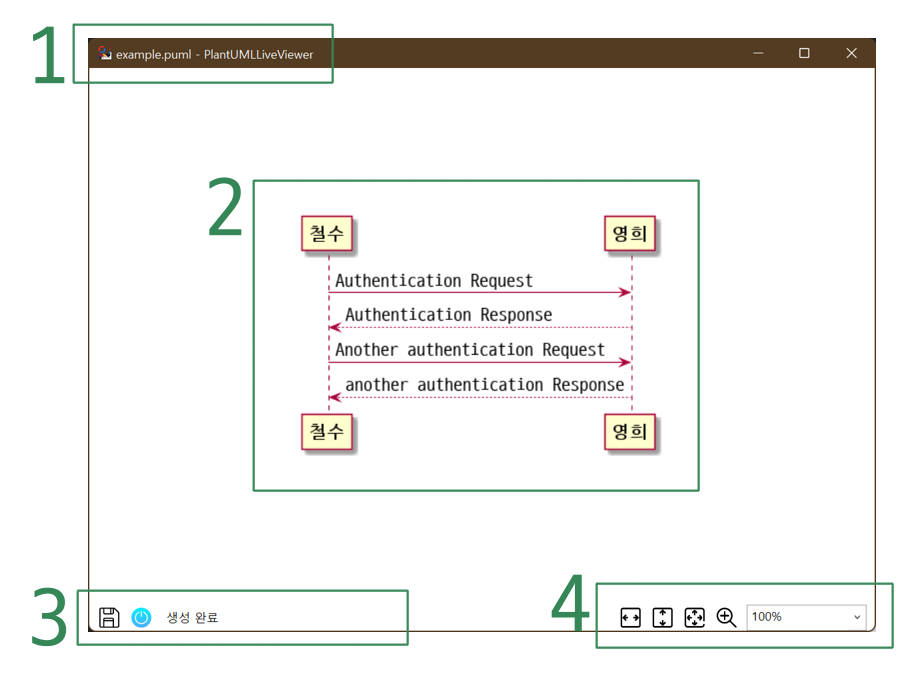

# PlantUMLLiveViewer
PlantUML 파일을 실시간으로 확인할 수 있는 도구 입니다.

## 목차
- [PlantUML](#plantuml)
- [PlantUMLLiveViewer](#plantumlliveviewer-1)
    - [기능](#기능)
    - [사용법](#사용법)
        - [Notepad++ 설정](#notepad-설정)
    - [실행 화면](#실행-화면)
    - [옵션 변경](#옵션-변경)
    - [요구 사항](#요구-사항)
- [다른 것](#다른-것)
- [이미지](#이미지)
    - [아이콘](#아이콘)
    - [앱 배경화면](#앱-배경화면)

## PlantUML

- [홈페이지](https://plantuml.com/)
- PlantUML은 다이어그램을 빠르게 작성하기 위한 오픈 소스 프로젝트입니다.
    - 시퀀스 다이어그램
    - 유스케이스 다이어그램
    - 클래스 다이어그램
    - 객체 다이어그램
    - 액티비티 다이어그램
    - 컴포넌트 다이어그램
    - 배치 다이어그램
    - 상태 다이어그램
    - 타이밍 다이어그램
- 빠르게 == 키보드로 마우스 없이

## PlantUMLLiveViewer

### 기능

- 텍스트 파일 내용 실시간 확인
    - PlantUML 홈페이지에서 배포되는 실행 파일은 텍스트 파일을 이미지 파일로 생성해주는 도구 입니다.
    - 작성 도중 내용을 확인하기 위해서 파일을 생성하고 뷰어에 리프레시를 요청해야 하는 불편함이 있습니다.
    - PlantUMLLiveViewer는 파일 변경이 감지되면 해당 파일을 임시 폴더에 이미지로 생성하고 보여줍니다.
- PlantUML 자동 다운로드
    - 최초 실행 시 <PlantUMLLiveViewer 폴더>/plantuml 폴더에 PlantUML 1.2022.1 버전을 다운로드 합니다.
    - 원하는 버전이 있으면 위 폴더에 plantuml.jar 파일을 변경하시면 됩니다.

### 사용법
- PlantUMLLiveViewer.exe <.puml 파일><br />
  이렇게 실행하면 아래와 같은 화면을 볼 수 있습니다.
- .puml이 있는 폴더에 PlantUMLLiveViewer.exe의 바로가기를 만들고, 드래그 드랍으로 실행하면 좀 더 편리합니다.
- Notepad++이나 VSCode 등 사용하시는 편집기에 사용자 명령으로 추가하셔도 편리합니다.

### Notepad++ 설정
- Notepad++ 예시) %APPDATA%/Notepad++/shortcuts.xml 파일의 UserDefinedCommands 내에 아래와 같은 명령 입력하시고
  ```
  <Command name="Open .puml live viewer" Ctrl="no" Alt="no" Shift="no" Key="0">"C:\PlantUMLLiveViewer\PlantUMLLiveViewer.exe" "$(FULL_CURRENT_PATH)" </Command>
  ```
  Notepad++을 다시 실행해서 원하는 단축키를 설정하시면 됩니다.
- Notepad++로 사용하실 때에는 아래의 사용자 정의 언어 파일을 추가하시면 더욱 편리합니다.
    - [Notepad++ PlantUML UDL](https://github.com/brianmaher84/PlantUML_Notepad-_UDL)

### 실행 화면

<center></center>

1. 창 제목에서 현재 보고 있는 파일을 확인 할 수 있습니다.
1. .puml 파일에서 생성된 결과를 확인합니다.<br />
   스크롤이 필요한 경우 드래그로 스크롤 할 수 있습니다.
1. 순서대로 아래의 기능입니다.
    1. 보고 있는 .puml 파일과 동일한 폴더에 결과물을 저장합니다.<br />
       C:\PlantUMLFiles\example.puml을 확인 중이면 C:\PlantUMLFiles\example.png로 저장됩니다.
    1. 최근 실행한 명령의 표준 출력, 오류를 확인합니다.<br />
       PlantUML 실행에서 발생한 오류를 확인하는 데 사용합니다.
    1. 최근 실행한 명령의 결과 메시지입니다.
1. 확대 비율을 변경합니다. 순서대로 아래와 같습니다.
    1. 가로 크기에 맞춰 확대 합니다. (세로만 스크롤 되는 상태)
    1. 세로 크기에 맞춰 확대 합니다. (가로만 스크롤 되는 상태)
    1. 창에 가득 채워지도록 확대 합니다. (스크롤 없는 상태)
    1. 100%로 되돌립니다.
    1. 직접 확대 비율을 입력합니다.

### 옵션 변경

- 옵션 변경은 [App.xaml.cs](./App.xaml.cs)를 수정하시면 됩니다.<br />
  ```csharp
  // PlantUMLFile 파일을 받을 하위 폴더 이름
  private const string PlantUMLFolder = "plantuml";
  // 받은 PlantUML jar 파일 이름
  private const string PlantUMLFile = "plantuml.jar";
  // 다운 받을 PlantUML jar 파일 URL
  private const string PlantUMLDownloadURL = "https://github.com/plantuml/plantuml/releases/download/v1.2022.1/plantuml-1.2022.1.jar";
  // .puml 파일 인코딩
  private const string inputCharset = "-charset utf8";
  // 저장 기능으로 사용할 출력 파일 형식
  private const string saveFormat = "-tpng";
  ```

### 요구 사항

- 실행 환경
    - JRE(JAVA)
    - .NET Framework 4.8 런타임
    - Windows
- 빌드 환경
    - Visual Studio 2022
    - .NET Framework 4.8

## 다른 것

- [Water PlantUML](https://github.com/Ebonsignori/water-plant-uml)
    - .puml 파일을 렌더링한 웹페이지를 웹브라우저로 볼 수 있습니다.
    - 파일을 수정하고 웹페이지를 새로고침해서 변경된 내용을 확인할 수 있습니다.
    - Node.js로 작성되어 npm으로 설치할 수 있습니다.

## 이미지

### 아이콘
- [Width icons created by Freepik - Flaticon](https://www.flaticon.com/free-icons/width)
- [Resize icons created by Freepik - Flaticon](https://www.flaticon.com/free-icons/resize)
- [Power icons created by Uniconlabs - Flaticon](https://www.flaticon.com/free-icons/power)
- [Zoom in icons created by Freepik - Flaticon](https://www.flaticon.com/free-icons/zoom-in)
- [Save icons created by Freepik - Flaticon](https://www.flaticon.com/free-icons/save)

### 앱 배경화면
- [illustrated by 머쉬룸](https://blog.naver.com/lastmistake/221002125678)